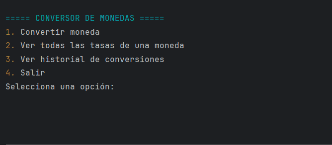

<h1 align="center">💱 Conversor de Monedas en Java</h1>

<p align="center">
  
</p>


<p align="center">
  <b>Un conversor de monedas interactivo hecho en Java usando la API de ExchangeRate.</b><br>
  Menú en consola, colores, validación de datos y cálculos en tiempo real.
</p>

---

## 📌 Descripción
Este proyecto es un **conversor de monedas** desarrollado en **Java** que se conecta a la API de <a href="https://www.exchangerate-api.com/">ExchangeRate</a> para obtener tasas de cambio actualizadas en tiempo real.

Incluye un **menú interactivo** en consola con colores, validación de entradas, y la posibilidad de realizar múltiples conversiones en una misma sesión.

Ideal como proyecto educativo para aprender:
- Consumo de APIs REST en Java
- Manejo de JSON con **Gson**
- Uso de colores ANSI en consola
- Programación orientada a objetos

---

## 🎯 Funcionalidades principales
✅ Conversión de cualquier moneda a otra  
✅ Toma de valores en tiempo real desde la API  
✅ Validación de códigos de moneda (ISO 4217)  
✅ Posibilidad de realizar múltiples conversiones sin reiniciar  
✅ Historial de conversiones en la sesión  
✅ Colores para mejor legibilidad en consola  
✅ Menú claro e intuitivo


---

## 🖼 Video demostrativo / Menú principal

<p align="center">
  
</p>

- El GIF muestra cómo funciona el menú principal y cómo se realiza una conversión.  
- Incluye validación de monedas, ingreso de cantidad y cálculo automático de la conversión.

---


**📍 Ejemplo de conversión**

Ingrese moneda de origen (ej: USD): USD

Ingrese moneda destino (ej: CLP): CLP

Ingrese cantidad a convertir: 100

💵 100 USD equivalen a 95,230 CLP

---

## ⚙️ Tecnologías utilizadas
- **Java 17+**
- **Gson** para manejar JSON
- **API ExchangeRate** para tasas de cambio
- **IntelliJ IDEA** como IDE
- ANSI Escape Codes para colores

---

## 🚀 Instalación y uso

1️⃣ **Clonar repositorio**

git clone https://github.com/graceppih/ConversorMonedas-Java.git
cd ConversorMonedas-Java

2️⃣ Agregar la librería Gson
Coloca gson-2.10.1.jar en la carpeta lib y añádelo al classpath en IntelliJ:
File > Project Structure > Modules > Dependencies > + JARs or Directories

3️⃣ Ejecutar
En IntelliJ, ejecuta ConversorMonedasMenu.java

📡 API utilizada
Este proyecto utiliza:

https://v6.exchangerate-api.com/v6/TU_API_KEY/latest/USD
Puedes obtener una clave gratuita en https://www.exchangerate-api.com/.


<p align="center"> ✨ Desarrollado con ❤️ por Grey Muñoz González ✨ </p> ```
